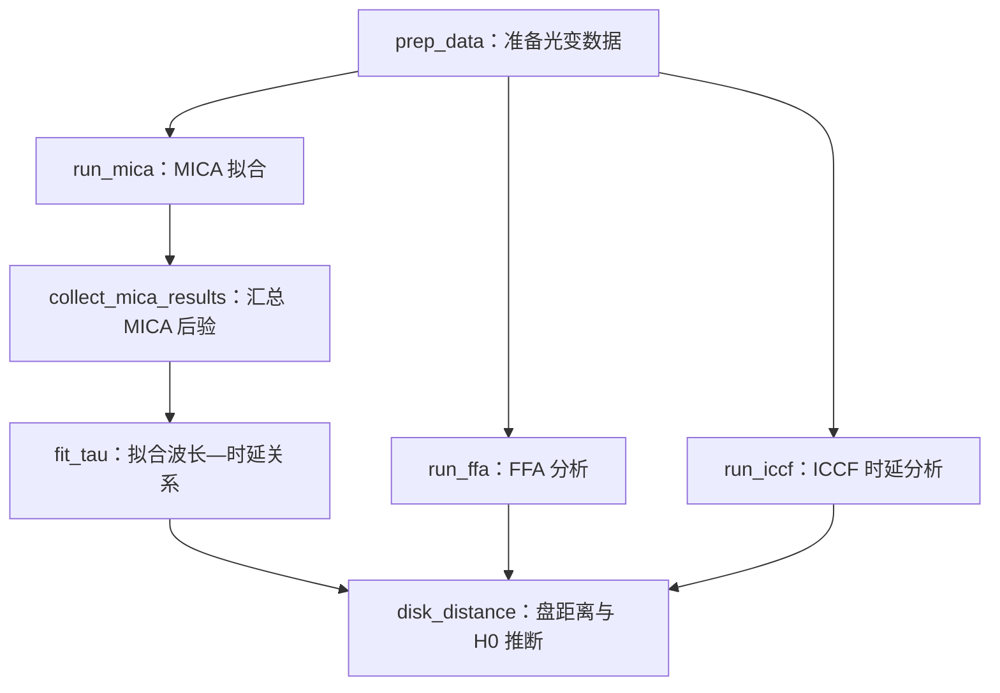

# Mrk 142：MICA2 拟合与 \(H_0\) 数据分析对话整理

> 本文是本次对话的内容整理稿。内容按讨论顺序与主题重新编排，保留了关键问题、公式、数值结果、判断和代码修改建议；上传的源码、压缩包及图片内容未附入本文。

## 1. 数据分析流程梳理

### 用户问题

> 看一下，梳理一下这个数据分析流程。

本项目的总体分析链条可整理为：



其中 `main.py` 负责组织各分析阶段；与本次讨论最密切的下游链条是：

1. MICA 对不同波段的转移函数进行拟合；
2. `collect_mica_results.py` 汇总各波段的转移函数参数后验；
3. `fit_tau.py` 根据各波段时延拟合波长—时延关系；
4. `disk_distance.py` 将时延、通量等信息转换为距离后验，再推断 \(H_0\)。

## 2. \(H_0\) 是否可能被高估，以及统计方法是否恰当

### 用户问题

> \(H_0\) 在这个流程中是否存在高估的可能？统计方法使用是否恰当？

### 对话中形成的分析

先纠正一个容易混淆的点。单纯做

\[
H_0=\frac{A}{D}
\]

不会给中位数引入 Jensen 偏差，因为单调变换满足

\[
\operatorname{median}(A/D)=A/\operatorname{median}(D).
\]

真正会移动中心值的是后面的统计重构。

### 2.1 最明确的中心上偏：线性均匀 \(H_0\) 先验

令

\[
\mathbf y=E(\log\mathbf D),\qquad
C_f=C+f_0^2I,\qquad
A=70d_{70}.
\]

固定 \(f_0\) 时，定义

\[
s_f^2=\left(\mathbf1^TC_f^{-1}\mathbf1\right)^{-1},
\]

以及逆协方差加权的对数距离

\[
\bar y_f=
\frac{\mathbf1^TC_f^{-1}\mathbf y}
{\mathbf1^TC_f^{-1}\mathbf1}.
\]

似然中心为

\[
H_{0,\mathrm{ML}}=A\exp(-\bar y_f).
\]

代码使用线性均匀先验 \(p(H_0)=\mathrm{const}\)，并报告 posterior 中位数。忽略先验边界时，可以推出

\[
\boxed{
H_{0,50}^{\rm code}
=H_{0,\mathrm{ML}}\exp(s_f^2)
}.
\]

因此，相比最大似然结果或对数均匀先验 \(p(H_0)\propto1/H_0\)，中心值会系统上移。

| \(s_f=\sigma_{\ln H_0}\) | 中心上移 |
|---:|---:|
| 0.10 | 1.0% |
| 0.20 | 4.1% |
| 0.30 | 9.4% |
| 0.40 | 17.4% |

如果数据很弱，默认先验 \(20<H_0<120\) 的中位数是 70，因此结果可能被拉向 70。这里真正产生锚定的是先验区间的线性中点，而不是 \(d_{70}\) 中作为归一化使用的 70。

即使把 \(f_0\) 边缘化，仍然有

\[
p_{\rm uniform,H}(H\mid\mathrm{data})
\propto
H\,p_{\rm uniform,logH}(H\mid\mathrm{data}),
\]

所以偏移方向仍然是偏向更大的 \(H_0\)。

### 2.2 最明确的中心下偏：事后删除负时延

流程会删除所有 \(\tau\leq0\) 的样本。固定 \(\beta\) 路径中，各波段时延都是同一个 \(\tau_0\) 乘以正数，因此该处理基本等价于条件化

\[
p(\tau_0\mid\tau_0>0).
\]

如果原 posterior 中负值比例为 \(r\)，截断后的中位数对应原 posterior 的

\[
\frac{1+r}{2}
\]

分位数，而不再是第 50 百分位。因此

\[
\tau_0\ \text{中心上移}
\Longrightarrow
D\ \text{上移}
\Longrightarrow
H_0\ \text{下移}.
\]

玩具高斯例子：

- 负时延占 2.3% 时，\(H_0\) 中心约下移 1.4%；
- 负时延占 15.9% 时，中心约下移 16.7%。

实际量级需要把 `valid_fraction` 拆成负时延、负通量、\(\epsilon\) 越界等不同原因的拒绝比例；当前代码只保存总有效率，无法区分。

### 2.3 其他统计处理对中心的影响

| 处理 | 对中心的主要影响 |
|---|---|
| 将 distance posterior 压缩成 `mean(logD)` 和 covariance | 若 \(\log D\) 真是多元高斯则不偏；偏斜或多峰时会强制将中心放到均值，方向不定。 |
| 将 posterior 当作 likelihood 再乘新先验 | 如果上游 posterior 已含信息先验，会重复或重新加权先验；方向取决于上游先验。 |
| flux–lag 独立随机配对 | 不筛选时不会改变各波段 \(E(\log D)\)，没有一阶中心偏差；但会改变协方差、多波段权重和 \(e^{s_f^2}\) 上移量。 |
| 各波段 lag 独立重采样 | 固定 \(\beta\) 时线性估计的均值不变，主要改变方差；经过 \(\log\tau\)、截断和最终先验后才会间接移动中心。 |
| 边缘化 \(f_0\) | \(f_0\) 增大时权重趋向等权。若各波段中心不一致，联合中心可向任一方向移动，同时会增大均匀 \(H_0\) 先验的上推。 |
| 随机子采样、MCMC seed | 理想情况下只是蒙特卡洛误差，不是定向偏差；未收敛时中心可能任意漂移。 |

因此，流程中存在两个方向明确、可能互相抵消的效应：

\[
\text{线性均匀 }H_0\text{ 先验：向上},
\qquad
\text{负时延截断：向下}.
\]

中心值看起来“合理”并不能证明流程无偏，因为两种偏差可能恰好互相抵消。

### 2.4 建议的实证诊断

1. 使用当前 `hubble_posterior.txt`，按 \(w_i=1/H_{0,i}\) 重新加权并取加权中位数。这可得到相同边界下的 log-uniform-\(H_0\) 中心，隔离先验引起的上移。
2. 同时报告 \(H_{0,\mathrm{ML}}\)、当前 posterior median、log-uniform posterior median，以及固定 \(f_0=0\) 的中心。
3. 从 `distance_posterior.txt` 比较每个波段的 `mean(logD)` 和 `median(logD)`，测量高斯压缩造成的中心位移。
4. 分别统计各种无效样本的拒绝比例，而不是只保存总 `valid_fraction`。

## 3. 阅读 MICA2 代码并建立 Mrk 142 分析目标

### 用户说明

> 读一下 MICA2 代码，一会需要帮助分析 MICA 拟合得到的数据结果。

> 我们只关注 Mrk 142。我使用 W2 近似作为 driver。期望转移函数的两个组分中，一个是盘主导，另一个用于吸收非盘部分。一共有五个数据，将逐一发送。第一个看完后共同确定分析流程，后续按同一流程处理；不同波段可能有不同特性，可以做适当调整。

### MICA2 中与本分析直接相关的参数含义

- 双高斯模型中，每个组分包含幅度、中心和宽度参数。
- 高斯转移函数的 `center` 是中心时延，`width` 是高斯标准差 \(\sigma\)。
- `amp` 对应积分响应强度，因此两个组分的相对响应占比可写为

  \[
  F_i=\frac{f_i}{f_1+f_2}.
  \]

- `TypeLagPrior=0` 主要约束组分中心的顺序，并不保证两个标签始终对应固定的物理来源。因此需要检查 label degeneracy。
- MICA 输出的 `posterior_sample1d` 是由带权样本重采样得到的等权后验，可能包含重复样本。做精确统计时，更合适的是使用原始 `sample1d.txt_2` 与 `weights.txt`。
- 对 Gaussian 转移函数，代表性 lag 是中心；对 Gamma 转移函数，代码中的 lag 定义不同，不能把两种模型的样本直接混合。

## 4. 各波段结果与分析流程的逐步确定

### 4.1 M2 波段

用户判断：

> M2 波长短，盘转移函数本身也很类似高斯函数，非盘部分影响不大，结果符合预期。重点关注宽度；按理宽度不应太窄，至少应与中心处于同一量级。

M2 的主要特征是第一组分几乎占据全部响应，第二组分很弱。第一组分中心非常接近零，但宽度明显大于中心，因此不属于“窄 \(\delta\) 函数”形态。

### 4.2 W1 波段

W1 的分析延续 M2 流程，重点考察：

1. 两个组分的相对响应占比；
2. 主组分的中心 \(\tau\) 与宽度 \(\sigma\)；
3. 是否存在被推向极窄宽度的解；
4. 第二组分是否真的被数据约束，还是只承担弱的背景或常数项。

### 4.3 U 波段：开始重点检查宽度异常与标签退化

用户确认：

> MICA 确实有把宽度往下逼的 bug，修复需要一些时间，暂时先不处理。可以检查后验中有多少结果符合预期设定，即中心与 \(\sigma\) 的比值大致为 1–3。从 U 波段开始需要格外注意。

定义

\[
q\equiv\frac{\tau_1}{\sigma_1},
\]

其中 \(\tau_1,\sigma_1\) 是 MICA 第一个高斯组分的中心与宽度。最初将后验分为：

- \(q<1\)：中心小于宽度；
- \(1\leq q<3\)：相对符合预期的宽高斯；
- \(q>3\)：宽度相对中心过窄，容易接近 \(\delta\) 函数解。

对 U 波段还必须检查组分标签退化：一部分样本中第一组分可能不再是盘组分，而第二组分接管较短时延的盘响应。因此，只按固定标签解释两个组分可能产生误判。

### 4.4 B 波段：明确三类后验统计

用户提出后续核心分析方式：

> 针对全部后验、\(q<3\)、\(q>3\) 三个类别，分别计算参数 \(f,\sigma,\tau\) 的中心和不确定度。

用户预期存在一种双高斯通用解：

> 一个 \(\delta\) 函数加一个宽高斯。前者把握光变形状，后者给出一个近似常数。这是双高斯的通用解，但没有物理意义；MICA 的宽度 bug 又会把解推向这种通用解。

B 波段的结论是：

- \(q>3\) 的窄解后验质量约为 27.45%；
- 但 \(q<3\) 与 \(q>3\) 两类样本中，第一组分中心分别约为 0.653 d 和 0.672 d，中心时延相对稳定；
- 第二组分的响应通常非常小，严格意义上的“窄 \(\delta\)+有显著幅度的宽高斯”样本只占很小一部分；
- 因此宽度 bug 明显影响形状解释，但对 B 波段中心时延的影响相对有限。

### 4.5 V 波段

V 波段的结论是：

- \(q>3\) 的后验质量约为 28.77%；
- 第一组分中心在 \(q<3\) 与 \(q>3\) 中分别约为 0.990 d 和 1.102 d，差异约为 11%；
- 存在约 6.87% 的标签退化样本；
- 第二组分整体较弱，非盘成分没有得到稳健约束。

## 5. 各波段后验在不同 \(q\) 区间的比例

| 波段 | \(q<1\) | \(1\leq q<3\) | \(q>3\) | \(q<3\) 合计 |
|---|---:|---:|---:|---:|
| M2 | 99.75% | 0.25% | 约 0% | 100.00% |
| W1 | 64.99% | 32.16% | 2.85% | 97.15% |
| U | 17.31% | 21.01% | 61.69% | 38.31% |
| B | 29.15% | 43.40% | 27.45% | 72.55% |
| V | 34.43% | 36.80% | 28.77% | 71.23% |

这里的比例应按原始 MICA posterior 权重计算，而不是简单按重采样后文件的行数计算。

## 6. 最终约定：只关注 \(q<3\) 的后验

用户最终要求：

> 只关注 \(q<3\) 的后验解，把所有波段这些后验分布中的 \(f,\tau,\sigma\) 列一个表出来。两个组分都列；\(f\) 用占比替代，也就是 \(f_i/(f_1+f_2)\)。

统计口径：

- 使用原始带权后验；
- 筛选条件为第一组分 \(q=\tau_1/\sigma_1<3\)；
- 中心采用加权中位数；
- 不确定度采用加权第 16–84 百分位区间；
- 组分 1 和组分 2 分别对应 MICA 的第 0、1 个高斯组分；
- 响应占比定义为 \(F_i=f_i/(f_1+f_2)\)。

### \(q<3\) 后验参数表

| 波段 | 组分 | \(F_i\)（%） | \(\tau\)（day） | \(\sigma\)（day） |
|---|---:|---:|---:|---:|
| M2 | 1 | \(99.859_{-1.529}^{+0.136}\) | \(0.0297_{-0.0193}^{+0.0477}\) | \(0.435_{-0.177}^{+0.186}\) |
| M2 | 2 | \(0.141_{-0.136}^{+1.529}\) | \(30.42_{-23.00}^{+21.08}\) | \(2.22_{-1.95}^{+14.76}\) |
| W1 | 1 | \(97.957_{-20.430}^{+2.032}\) | \(0.162_{-0.089}^{+0.111}\) | \(0.227_{-0.109}^{+0.272}\) |
| W1 | 2 | \(2.043_{-2.032}^{+20.430}\) | \(10.96_{-8.35}^{+32.44}\) | \(3.93_{-3.67}^{+12.96}\) |
| U | 1 | \(65.759_{-46.535}^{+24.037}\) | \(0.432_{-0.232}^{+0.160}\) | \(0.343_{-0.156}^{+12.567}\) |
| U | 2 | \(34.241_{-24.037}^{+46.535}\) | \(2.93_{-2.41}^{+6.07}\) | \(0.200_{-0.108}^{+3.53}\) |
| B | 1 | \(99.792_{-4.412}^{+0.204}\) | \(0.653_{-0.224}^{+0.236}\) | \(0.533_{-0.269}^{+0.498}\) |
| B | 2 | \(0.208_{-0.204}^{+4.412}\) | \(25.69_{-20.63}^{+21.82}\) | \(1.66_{-1.46}^{+12.17}\) |
| V | 1 | \(99.606_{-16.123}^{+0.387}\) | \(0.990_{-0.573}^{+0.608}\) | \(0.917_{-0.539}^{+1.835}\) |
| V | 2 | \(0.394_{-0.387}^{+16.123}\) | \(23.92_{-19.03}^{+25.88}\) | \(1.71_{-1.51}^{+9.93}\) |

注：表中写法为“加权中位数及相对的第 16–84 百分位误差”。等价的中位数与区间原始值如下：

- M2：组分 1 的 \(F=99.859\%[98.330,99.995]\)、\(\tau=0.0297[0.0104,0.0774]\)、\(\sigma=0.435[0.258,0.621]\)；组分 2 的 \(F=0.141\%[0.0047,1.670]\)、\(\tau=30.42[7.42,51.50]\)、\(\sigma=2.22[0.269,16.98]\)。
- W1：组分 1 的 \(F=97.957\%[77.527,99.989]\)、\(\tau=0.162[0.073,0.273]\)、\(\sigma=0.227[0.118,0.499]\)；组分 2 的 \(F=2.043\%[0.011,22.473]\)、\(\tau=10.96[2.61,43.40]\)、\(\sigma=3.93[0.259,16.89]\)。
- U：组分 1 的 \(F=65.759\%[19.224,89.796]\)、\(\tau=0.432[0.200,0.592]\)、\(\sigma=0.343[0.187,12.91]\)；组分 2 的 \(F=34.241\%[10.204,80.776]\)、\(\tau=2.93[0.524,9.00]\)、\(\sigma=0.200[0.092,3.73]\)。
- B：组分 1 的 \(F=99.792\%[95.380,99.996]\)、\(\tau=0.653[0.429,0.889]\)、\(\sigma=0.533[0.264,1.031]\)；组分 2 的 \(F=0.208\%[0.0042,4.620]\)、\(\tau=25.69[5.06,47.51]\)、\(\sigma=1.66[0.199,13.83]\)。
- V：组分 1 的 \(F=99.606\%[83.483,99.993]\)、\(\tau=0.990[0.417,1.598]\)、\(\sigma=0.917[0.378,2.752]\)；组分 2 的 \(F=0.394\%[0.0068,16.517]\)、\(\tau=23.92[4.89,49.80]\)、\(\sigma=1.71[0.202,11.64]\)。

### 6.1 跨波段趋势

固定使用 MICA 第一组分时，\(q<3\) 后验的中心时延呈单调增长：

\[
\mathrm{M2}:0.030
<\mathrm{W1}:0.162
<\mathrm{U}:0.432
<\mathrm{B}:0.653
<\mathrm{V}:0.990\ \mathrm{day}.
\]

这一顺序符合随波长增加、盘时延增大的总体预期。

但是 U 波段需要单独谨慎解释：它的 \(q<3\) 样本只占全部 posterior 的 38.31%，且两组分的幅度和宽度分布都很宽，标签退化比其他波段更严重。

## 7. Gaussian 与 Gamma 运行目录混放的问题

### 用户问题

> `runs` 目录里同一个波段的 Gamma 和 Gaussian 两种运行混在一起，后面的 `collectdata` 和 `fit_tau` 是否会混乱？如果会，代码应该怎么改？

### 结论

会混乱，而且有两种可能：

1. 如果目录中的波段名大小写与配置不一致，例如运行目录写成小写 `u`、配置中只有大写 `U`，汇总时可能直接发生 `KeyError`；
2. 如果名称都能被识别，`collect_mica_results.py` 会把同一波段的 Gamma 与 Gaussian 运行都收集进来，`fit_tau.py` 随后只按 `band` 分组，从而静默混合两种不同模型的 posterior。

这种混合在统计上不成立，因为：

- Gaussian 的代表性 lag 是 `center`；
- Gamma 的代码定义使用 `center + 2*width`；
- 两种模型的参数几何意义和先验也不同；
- 如果简单拼接，两个模型的相对权重还会由各自输出的行数偶然决定。

### 7.1 根本原因

当前收集逻辑大意为扫描根目录下所有符合命名规则的子目录：

```python
return sorted(
    p for p in root.iterdir()
    if p.is_dir() and parse_run_name(p.name)
)
```

它没有按以下信息进行严格筛选：

- driver；
- response band；
- `ncomp`；
- `type_tf`；
- 同一波段是否出现多个运行。

同时，汇总后的 posterior 文件只记录 `band`、波长和参数，没有保留 `run_name`、模型类型等元数据。因此 `fit_tau.py` 无法发现同一个 band 已被重复收集。

### 7.2 推荐的目录组织方式

将不同转移函数模型放到彼此独立的输出根目录，例如：

```text
runs/
├── mica_gaussian/
│   └── 2comp/
│       ├── run_W2_to_M2_2comp_gaussian/
│       ├── run_W2_to_W1_2comp_gaussian/
│       ├── run_W2_to_U_2comp_gaussian/
│       ├── run_W2_to_B_2comp_gaussian/
│       └── run_W2_to_V_2comp_gaussian/
└── mica_gamma/
    └── 2comp/
        ├── run_W2_to_M2_2comp_gamma/
        ├── run_W2_to_W1_2comp_gamma/
        ├── run_W2_to_U_2comp_gamma/
        ├── run_W2_to_B_2comp_gamma/
        └── run_W2_to_V_2comp_gamma/
```

每个配置只把 `output_root` 指向当前要分析的模型根目录。这可以从文件系统层面避免误混合。

需要先确认小写 `u` 目录确实对应 Swift U，再将命名统一为大写 `U`；不能在未确认数据含义时直接重命名。

### 7.3 `collect_mica_results.py` 应改成严格选择预期运行

建议不要扫描并接受所有可解析目录，而是根据配置逐一构造唯一的预期目录：

```python
TF_LABELS = {
    "gaussian": "gaussian",
    "tophat": "tophat",
    "gamma": "gamma",
    "exponential": "exp",
    "exp": "exp",
}


def run_dirs(source_dir, fit, cfg):
    root = mica_run_root(source_dir, fit, cfg)
    driver = str(fit.get("driver", cfg.get("driver", "W2")))
    responses = list(fit.get("responses", cfg.get("responses", [])))
    ncomp = int(fit.get("ncomp", 2))
    tf = str(fit.get("type_tf", "gaussian")).lower()

    if tf not in TF_LABELS:
        raise ValueError(f"Unsupported transfer-function type: {tf}")

    model = TF_LABELS[tf]
    expected = [
        root / f"run_{driver}_to_{band}_{ncomp}comp_{model}"
        for band in responses
    ]

    missing = [path for path in expected if not path.is_dir()]
    if missing:
        missing_text = "\n".join(str(path) for path in missing)
        raise FileNotFoundError(
            "Missing expected MICA run directories:\n" + missing_text
        )

    return expected
```

主循环相应改为：

```python
for run_dir in run_dirs(source_dir, fit, cfg):
    ...
```

这样，配置选择 Gamma 时只收集 Gamma，选择 Gaussian 时只收集 Gaussian；同一波段不会因为目录中还存在另一个模型而被重复加入。

### 7.4 汇总文件中必须保留模型元数据

建议在汇总表和 posterior 文件中加入：

```text
run_name, driver, band, model, ncomp, lambda_obs, sample, center, width, tau, weight
```

这样即使文件被误放到同一目录，也能在进入 `fit_tau.py` 前发现冲突。

### 7.5 `fit_tau.py` 增加唯一性检查

在按 band 拟合之前检查每个 band 是否只来自一个运行、一个模型：

```python
for band, group in posterior.groupby("band"):
    if group["run_name"].nunique() != 1:
        raise ValueError(
            f"Band {band} contains multiple MICA runs: "
            f"{group['run_name'].unique().tolist()}"
        )

    if group["model"].nunique() != 1:
        raise ValueError(
            f"Band {band} contains mixed transfer functions: "
            f"{group['model'].unique().tolist()}"
        )
```

该检查应视为保险机制；即使未来目录又被混放，流程也会明确报错，而不是产生看似正常、实际上混合了模型的结果。

### 7.6 \(q<3\) 筛选应使用原始带权样本

对于当前 Gaussian 分析，可在收集阶段加入配置项：

```yaml
posterior_q_max: 3.0
```

但应满足：

1. 只对 Gaussian 使用 \(q=\tau/\\sigma\) 的筛选；Gamma 参数的含义不同，不能套用同一 \(q\) 判据；
2. 读取 `sample1d.txt_2` 和 `weights.txt`；
3. 筛选 \(q<3\) 后重新归一化权重；
4. 将 `weight` 写入汇总 posterior；
5. `fit_tau.py` 按 `weight` 重采样或直接做带权统计，而不是默认每一行等权。

### 7.7 重新生成被污染的下游结果

修改后需要重新生成已有的汇总和下游文件，包括：

- MICA component summary；
- MICA transfer-function posterior；
- `fit_tau` 输出；
- 绝对时延结果；
- 后续距离及 \(H_0\) 结果。

另外，当前 `main.py` 的 `fresh` 或清理逻辑可能删除整个 `output_root`。如果 Gamma 与 Gaussian 共用同一个根目录，执行清理时可能同时删除两类运行。因此，把模型拆分到不同输出根目录不仅防止统计混合，也能降低误删风险。

## 8. 当前阶段的核心认识

1. \(H_0\) 存在被线性均匀先验系统上推的明确机制，上移因子在无边界近似下为 \(\exp(s_f^2)\)。
2. 删除负时延会把距离推高、把 \(H_0\) 推低；净偏差可能由两个相反效应共同决定。
3. MICA 的 Gaussian 宽度 bug 会增加窄组分或近似 \(\delta\) 函数解，因而必须按 \(q=\tau/\\sigma\) 检查后验结构。
4. 对 Mrk 142 的当前盘时延分析，约定只采用 \(q<3\) 的 Gaussian 后验，并使用原始 posterior 权重。
5. M2、W1、B、V 的第一组分大体由盘响应主导；U 波段存在更明显的多模态和标签退化，需要单独处理。
6. 在 \(q<3\) 样本中，固定第一组分的中心时延随 M2、W1、U、B、V 单调增加。
7. Gamma 与 Gaussian 运行绝不能按 band 直接拼接；收集代码应依据配置严格选择唯一运行，并在拟合前验证模型唯一性。
